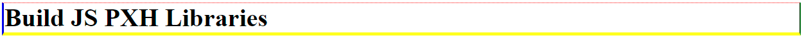

# BuildJSPXHLibraries

## Functions

##### jshBorder(selector);

```javascript
// EX 1: border-width, border-style, border-color
jshBorder("h1").Width("1px").Dotted().Color("red green blue yellow");
```


```javascript
// EX 2: border-style customize
jshBorder("h1")
  .Width("5px")
  .Style("dotted solid")
  .Color("red green blue yellow");
```


```javascript
// EX 3: border-top, border-right, border-bottom, border-left
jshBorder("h1", "top").Width("1px").Dotted().Color("red");
jshBorder("h1", "right").Width("2px").Groove().Color("green");
jshBorder("h1", "left").Width("3px").Ridge().Color("blue");
jshBorder("h1", "bottom").Width("4px").Inset().Color("yellow");
```



## License

[MIT](https://choosealicense.com/licenses/mit/)
