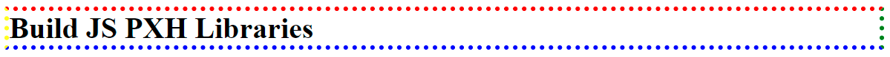

# BuildJSPXHLibraries

## Functions
```javascript
  jshBorder(selector)   
  
  // EX 1:
  jshBorder("h1").Width("1px").Dotted().Color("red green blue yellow")
  
```
## License
[MIT](https://choosealicense.com/licenses/mit/)