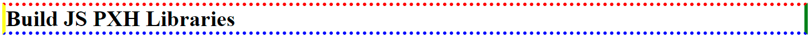

# BuildJSPXHLibraries

## Functions
##### jshBorder(selector);
```javascript
// EX 1: border-width, border-style, border-color
jshBorder("h1").Width("1px").Dotted().Color("red green blue yellow");
```


```javascript
// EX 2: border-style customize
jshBorder("h1")
  .Width("5px")
  .Style("dotted solid")
  .Color("red green blue yellow");
```



## License

[MIT](https://choosealicense.com/licenses/mit/)
