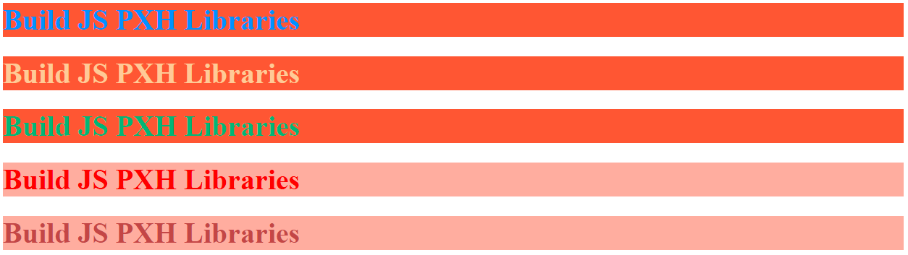
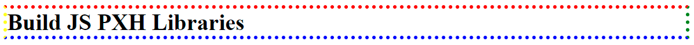
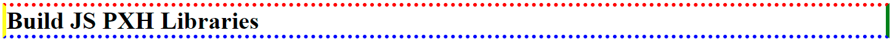
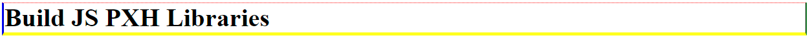

# BuildJSPXHLibraries

## Installation

```bash
Download files: jsh.js, cssh.css
```

## Functions

1. jshColor(selector)
2. jshBackground(selector, color)
3. jshBorder(selector)

##### jshColor(selector)

```javascript
// EX 1: colors, colors + backgroundColor
jshColor(".h1-0", "DodgerBlue").backgroundColor("#ff6347");
jshColor(".h1-1", "#fc9").backgroundColor("rgb(255, 99, 71)");
jshColor(".h1-2", "rgb(60, 179, 113)").backgroundColor("hsl(9, 100%, 64%)");
jshColor(".h1-3", "red").backgroundColor("hsla(9, 100%, 64%, 0.5)");
jshColor(".h1-4", "hsl(0, 40%, 50%)").backgroundColor("rgba(255, 99, 71, 0.5)");
```



##### jshBackground(selector, color)

```javascript
// EX 1: background-color, color, opacity
jshBackground("div", "green").Color("#fff").Opacity(0.3);
```


```javascript
// EX 2: conic-gradient
jshBackground("div").ConicGradient({
  color01: "red",
  color02: "yellow",
  color03: "green",
});
```


```javascript
// EX 3: linear-gradient
jshBackground("div").LinearGradient({
  color01: "red",
  color02: "yellow",
  color03: "green",
});
```


```javascript
// EX 4: radial-gradient
jshBackground("div").RadialGradient({
  color01: "red",
  color02: "yellow",
  color03: "green",
});
```


##### jshBorder(selector)

```javascript
// EX 1: border-width, border-style, border-color
jshBorder("h1").Width("1px").Dotted().Color("red green blue yellow");
```



```javascript
// EX 2: border-style customize
jshBorder("h1")
  .Width("5px")
  .Style("dotted solid")
  .Color("red green blue yellow");
```



```javascript
// EX 3: border-top, border-right, border-bottom, border-left
jshBorder("h1", "top").Width("1px").Dotted().Color("red");
jshBorder("h1", "right").Width("2px").Groove().Color("green");
jshBorder("h1", "left").Width("3px").Ridge().Color("blue");
jshBorder("h1", "bottom").Width("4px").Inset().Color("yellow");
```



## License

[MIT](https://choosealicense.com/licenses/mit/)
